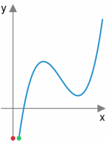
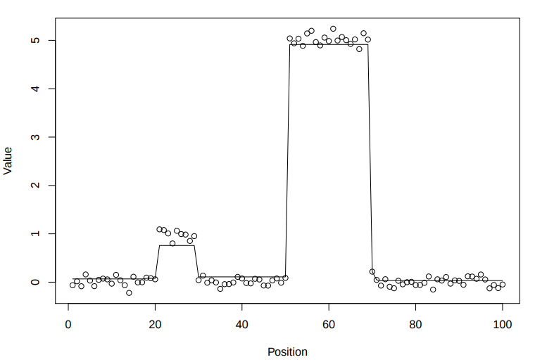
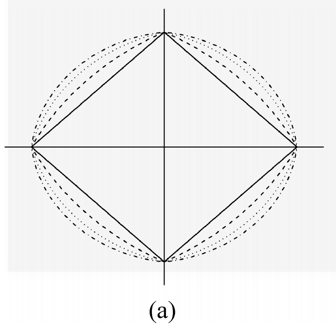
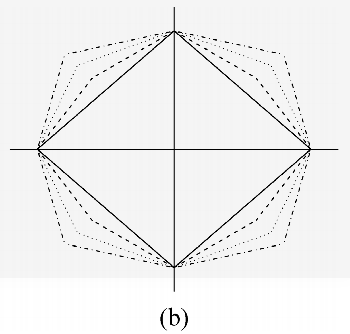

# 稀疏及结构化的Attention正则化框架
     
    2017_NIPS
    康奈尔大学, Vlad Niculae

论文提出**让Attention输出稀疏**且更关注**输入数据的片段或组**的正则化机制，它还能直接加入神经网络进行前向与反向传播。

论文地址: [A Regularized Framework for Sparse and Structured Neural Attention](https://papers.nips.cc/paper/6926-a-regularized-framework-for-sparse-and-structured-neural-attention.pdf)

## 1. 简单介绍:

**Attention的关键是映射函数**，它对输入元素的相对重要性进行编码，将数值映射为概率。而常用的关注机制**Softmax会产生密集的注意力**。因为softmax的输出都大于0，故其输入的所有元素对最终决策都有或多或少的影响。
 
为了克服softmax这种缺点，[From Softmax to Sparsemax:A Sparse Model of Attention and Multi-Label Classification](https://arxiv.org/pdf/1602.02068.pdf) 提出了能够**输出稀疏概率的Sparsemax**，这能为Attention提供更多的解释性。

本文基于Sparsemax，提出的方法既可以得到稀疏的输出，又可以作为一个诱导稀疏的惩罚模型，可作用于当前的其他模型上。 本文提出的通用框架是**建立在$\max$运算符上的，采用强凸（strong convex）函数进行调整后得到的算子是可微的，它的梯度定义了从输入数值到概率的映射，适合作为Attention机制**。

- 基于fused lasso提出了**Fusedmax鼓励网络对连续区域（或说文本段）的Attention值相同**。
- 限定连续区域的Attention值相同的假设太严苛，文中又基于oscar提出**Oscarmax的关注机制，鼓励网络对不连续的单词组的Attention值相同**。

上述只是文章简单概括。 疑问有很多，比如：建立在$\max$算子是什么意思？强凸函数怎么调整？梯度定义了映射函数？Fusedmax和Oscarmax又是怎么做到的？

那下面就一步步解释文章思路。

---
## 2. 论文的思路:

先给出一些定义：

- 集合$\{1,2,...,d\}$定义为$[d]$，$d-1$维的单形体为$\Delta^d:=\{x\in R^d:\mid\mid x\mid\mid_1=1,x \geq0\}$， 在欧几里得的投影为$P_{\Delta^d}(x):={\arg\min}_{y\in \Delta^d}\mid\mid y-x\mid\mid^2$
- 如果函数$f:R^d\rightarrow R\bigcup \{\infty\}$, 则其凸共轭(convex conjugate)为$f^{*}(x):=\sup_{y\in dom\;f}y^Tx-f(y)$.  给定范数$\mid\mid\cdot\mid\mid$,它的对偶定义为$\mid\mid x\mid\mid_* :=\sup_{\mid\mid y\mid\mid \leq 1}y^T x$. 用$\partial f(y)$ 表示函数$f$在$y$处的次微分 
> 次微分subdifferential,凸函数$f(x)=\mid x\mid$在原点的次微分是区间$[−1, 1]$.
- 函数$f$的Jacobian(雅可比)$J_{g}(y)\in R^{d\times d}$,Hessian(海森矩阵)$H_{f}(y)\in R^{d\times d}$

现在我们看下$max$算子（虽然是$R^d \rightarrow \Delta^d$的映射函数，但不适合作为Attention机制):
$$\max(x):=\max_{i\in [d]} x_i = \sup_{y\in \Delta^d} y^Tx$$ 

由于在单形体的线性上确界总是顶点，也即为标准基向量$\{e_i\}^d_{i=1}$的其中之一。 这也容易看出这个上确界$y^*$ 就是$\max(x)$的一个次梯度$\partial \max(x) =\{e_{i^*} : i^* \in \arg\max_{i\in [d]} x_i\}$.

我们将这些次梯度看作一种映射：$\prod:R^d \rightarrow \Delta^d$,它将所有的概率质量都放在一个元素上(即$\max$操作只有一个元素获得非0输出):$\prod(x) = e_i,\; for \;any\; e_i \in \partial \max(x)$.

因为这映射函数不连续（存在阶跃断点），这不适合通过梯度下降法进行优化,显然这种属性我们是不希望的.

从这可以看出，$\max(x)$的次梯度$y^*$是$\prod:R^d \rightarrow \Delta^d$映射，**如果$\max(x)$的变种函数是连续可二次微分，那$y^*$也就可以用作Attention，且也能够让梯度下降方法进行优化了（梯度为$y^*$的导数）**。
>注意，此处$\prod(x)$也表示Attention的输出，如果$\prod(x)$可导，就可以嵌入普通神经网络进行梯度下降优化了。

受到[Y.Nesterov. Smooth minimization of non-smooth functions](http://luthuli.cs.uiuc.edu/~daf/courses/optimization/MRFpapers/nesterov05.pdf)的启发,本文运用了Smooth技术. 对于$\max(x)$的共轭函数${\max}^*(y)$:
$$ 
{\max}^*(y)=\left\{
             \begin{array}{l}
             0, & if\; y\in \Delta^d \\
             \infty, & o.w. 
             \end{array}\right.
$$ 
>该共轭函数的证明在[Smooth and strong: MAP inference with linear
convergence, Appendix B](http://papers.nips.cc/paper/5710-smooth-and-strong-map-inference-with-linear-convergence) 中。其实通过求解共轭函数的方法就可以得解：$max^*(y)=\sup(y^Tx-\sup z^Tx)$, 对$x$求偏导得$y^*=z^*$再带入原式即可。

那现在将正则化添加到共轭函数中：
$$ 
{\max}^*_{\Omega}(y)=\left\{
             \begin{array}{l}
             \gamma\Omega(y), & if\; y\in \Delta^d \\
             \infty, & o.w. 
             \end{array}\right.
$$ 
其中假设函数$\Omega:R^d\rightarrow R$是关于norm $\mid\mid\cdot\mid\mid$的**$\beta$-strongly convex**($\beta强凸$)。$\gamma$ 控制着正则强度。

>
参考[Strong Convexity and Smoothness](https://cswhjiang.github.io/2015/04/08/strong-convexity-and-smoothness/)：
>
>- 函数$f$是 $\alpha$-strong convex($\alpha > 0$)需要满足条件：
>$$
f(y)-f(x)\geq \nabla f(x)^T(y-x) + \frac{\alpha}{2}\mid\mid y-x \mid\mid^2_P
$$
>- 如果一个连续可微的函数$f$的梯度$\nabla f(x)$是$\beta$-Lipschitz的，即：
>$$
\mid\mid\nabla f(x)-\nabla f(y)\mid\mid \leq\beta\mid\mid x-y\mid\mid,
$$
>那么我们称 $f(x)$ 是$\beta$-smooth的,更一般表示为：
>$$
\mid\mid\nabla f(x)-\nabla f(y)\mid\mid_D \leq\beta\mid\mid x-y\mid\mid_P,
$$
>其中$\mid\mid\cdot\mid\mid_P$是范数norm，$\mid\mid\cdot\mid\mid_D$是对偶范数dual norm。
>
>- 函数的$\alpha$-strongly convex和 $\beta$-smoothness有对偶关系，如果函数$f$是关于对偶范数 $\mid\mid\cdot\mid\mid_D$ 的$\beta$-smooth,那么$f^*$是关于范数$\mid\mid\cdot\mid\mid_P$的$\frac{1}{\beta}$-strongly convex。 其中$f^*=\max_y(y^Tx-f(y))$是函数$f(x)$的共轭函数。
>
>Wiki中也可以查阅详细定义与解释。

为了定义出平滑的$\max$算子: $\max_{\Omega}$，再次使用共轭：
$$
{\max}_{\Omega}(x)=max_{\Omega}^{**}(x) = \sup_{y\in R^d} y^Tx - {\max}^*_{\Omega} (y)=\sup_{y\in\Delta^d}y^Tx-\gamma\Omega(y)
$$

由此，前面提到的映射${\prod}_{\Omega}: R^d\rightarrow \Delta^d$定义为：
$$
{\prod}_{\Omega}(x):=\arg\max_{y\in \Delta^d}y^Tx-\gamma\Omega(y)=\nabla max_{\Omega}(x)
$$
> 1. 上述式子可由：$\max_{\Omega}(x)=(y^*)^Tx-\max^*_{\Omega}(y^*)\Longleftrightarrow y^* \in \partial\max_{\Omega}(x)$ 证得。
> 2. $\partial\max_{\Omega}(x)=\{\nabla\max_{\Omega}(x)\}$只有唯一解（$y^*$是单形体的顶点）。故$\prod_{\Omega}$ 是梯度的映射函数。

**强凸的重要性：**

对$\Omega$的$\beta$-strongly convex的假设是很重要的，如果函数$f:R^d\rightarrow R$ 的共轭函数 $f^*$ 是关于对偶范数 $\mid\mid\cdot\mid\mid_D$ 的$\frac{1}{\beta}$-smooth, 那么 $f$ 就是关于范数 $\mid\mid\cdot\mid\mid_P$ 的 $\beta$-strongly convex。那么这足以确保 $\max_{\Omega}$是$\frac{1}{\gamma\beta}$-smooth, 或者说 $\max_{\Omega}$ 处处可微，且它的梯度 $\prod_{\Omega}$ 在对偶范数 $\mid\mid\cdot\mid\mid_D$上是 $\frac{1}{\gamma\beta}$-Lipschitz的.

**训练问题（$\prod_{\Omega}$即表示Attention的输出）：**

- 前向时，需要解决的问题是：如何计算 $\prod_{\Omega}$ ?
- 反向时，需要解决的问题是：如何计算 $\prod_{\Omega}$ 的雅可比矩阵？或说如何计算 $\max_{\Omega}$ 的Hessian矩阵？

---
## 3. 验证方法：用正则项 $\Omega$恢复Softmax与Sparsemax

在推导新的Attention机制前，先展示如何用正则项$\Omega$恢复出softmax和sparsemax。

### 3.1 Softmax：

选择$\Omega(y)=\sum_{i=1}^d y_i \log y_i$ ,即负熵。则它的共轭函数为 $log\;sum\;exp$, 即$f^*(y)=\log \sum_{i=1}^d e^{y_i}$.
>证明此时$\Omega(y)$的共轭函数为 $log\;sum\;exp$ :

>若函数 $f(x)=\log \sum_{i=1}^n e^{x_i}$ ,则由$f^*(y)=sup y^Tx-f(x)$ 对$x$求偏导得：$y_i=\frac{e^{x_i}}{\sum_{i=1}^n e^{x_i}}$ , 即$1^Ty=1,\sum y_i =1$.
> 
>  故有$e^{x_i}=y_i\sum e^{x_i} \Rightarrow$
>  
>$$\begin{array}{l}
f^*(y) & =\sum y_i x_i - log\sum e^{x_i} \\
& =\sum y_i \log(y_i\sum e^{x_i})-\log\sum e^{x_i} \\
& = \sum y_i\log y_i + \sum y_i \log\sum e^{x_i}-\log\sum e^{x_i} \\
& = \sum y_i\log y_i
\end{array}$$
> 由于$f(x)$是凸函数（可证），所以$f^{**}=log\;sum\;exp$.
> 也可以查阅[《Convex optimization》](https://web.stanford.edu/~boyd/cvxbook/bv_cvxbook.pdf)的习题3.25, 里面有详细证明。

如果 $f(x)=\gamma g(x)$,则对于 $\gamma >0$,有 $f^*(y)=\gamma g^*(y/\gamma)$. 则${\max}_{\Omega}(x)=\gamma \log\sum_{i=1}^d e^{x_i / \gamma}$. 

由于$\Omega(y)$负熵在 $\mid\mid\cdot\mid\mid_1$ 是 1-strongly convex，所以${\max}_{\Omega}$在 $\mid\mid\cdot\mid\mid_{\infty}$ 上是$\frac{1}{\gamma}$-smooth. 

通过对 ${\max}_{\Omega}$ 的 $x$ 求偏导即得softmax：
$$
{\prod}_{\Omega}(x) = \frac{\partial {\max}_{\Omega}}{\partial x}=\frac{e^{x/\gamma}}{\sum_{i=1}^d e^{x_i/\gamma}} 
$$

其中 $\gamma$越小，输出的 $softmax$就越尖锐。[Distilling the Knowledge in a Neural Network](https://arxiv.org/abs/1503.02531?context=cs) 里面也涉及到$\gamma$的设计。

---
### 3.2 Sparsemax：

选择 $\Omega(y)=\frac{1}{2}\mid\mid y\mid\mid^2_2$, 它也被称为Moreau-Yosida正则化常用于近端算子理论。

由于 $\frac{1}{2}\mid\mid y\mid\mid^2_2$ 在$\mid\mid\cdot\mid\mid_2$ 中是 1-strongly convex，所以在${\max}_{\Omega}$在$\mid\mid\cdot\mid\mid_2$上是$\frac{1}{\gamma}$-smooth.

由此能得：
$$
{\prod}_{\Omega}(x)=P_{\Delta^d}(x/\gamma) = \arg\min_{y\in \Delta^d}\mid\mid y-x/\gamma\mid\mid^2
$$

当$\gamma=1$时，上式就为Sparsemax（softmax的一个稀疏替代）。

这推导得出：调控 $\gamma$ 可以控制稀疏性。根据sparsemax的论文[From softmax to sparsemax: A sparse model of attention and multi-label classification](https://arxiv.org/pdf/1602.02068.pdf)中的公式 $9$可以知道 ${\prod}_{\Omega}$ 的雅可比矩阵为:
$$
J_{{\prod}_{\Omega}}(x)=\frac{1}{\gamma}J_{P_{\Delta^d}}(x/\gamma)=\frac{1}{\gamma}\big(diag(s)-ss^T/\mid\mid s\mid\mid_1\big)
$$
> 其中 $s\in\{0,1\}^d$ 指示着 ${\prod}_{\Omega}(x)$ 的非$0$元素。
> 
> ${\prod}_{\Omega}(x)$ 是Lipschitz 连续，处处可导。
> 
> 详情建议阅读sparsemax的论文。 

---
## 4. Fusedmax与Oscarmax 新Attention机制

论文提出 **论点 $1$：如果 $\Omega$ 函数可微，那可以计算出 ${\prod}_{\Omega}$ 的雅可比矩阵 .**
> 论文附录 $A.1$ 已证明，只要提供了$\Omega$的Jacobian和Hessian，那就可以根据论文提供的公式计算出 $J_{{\prod}_{\Omega}}$ .

那来一个简单例子吧。

### 4.1. 示例：Squared p-norms（平方 p-范式）

Squared p-norms作为单纯形上可微函数的一个有用例子：$\Omega(y)=\frac{1}{2}\mid\mid y\mid\mid^2_p = \big(\sum_{i=1}^d y_i^p \big)^{2/p}$ , 其中 $y\in\Delta^d$ 且 $p\in(1,2]$. 

我们已知 squared p-norm 在$\mid\mid\cdot\mid\mid_p$是strongly convex, 这也指出，当$\frac{1}{p} + \frac{1}{q} = 1$时， ${\max}_{\Omega}$ 在 $\mid\mid\cdot\mid\mid_q$ 是$\frac{1}{\gamma(p-1)}$-smooth 。计算出sq-pnorm-max为：
$$
{\prod}_{\Omega}(x)= \arg\min_{y\in \Delta^d} \frac{\gamma}{2}\mid\mid y\mid\mid^2_p - y^Tx
$$

论点$1$ 所需要的梯度和Hessian可以通过 $\nabla\Omega(y)=\frac{y^{p-1}}{\mid\mid y\mid\mid^{p-2}_p}$ 以及下式得到所需要的$J_{{\prod}_{\Omega}}$.
$$
H_{\Omega}(y)=diag(d)+ uu^T,\quad where \quad d=\frac{(p-1)}{\mid\mid y\mid\mid^{p-2}_p}y^{p-2} \quad and \quad u=\sqrt{\frac{(2-p)}{\mid\mid y\mid\mid^{2p-2}_p}} y^{ p-1}
$$
> sq-pnorm-max 的 $p = 2$ 时就恢复为 sparsemax 一样鼓励稀疏输出。 
> 
> 但$1<p<2$ 时，$y^*=[0,1]$和$y^*=[0,1]$ 间的转换将会更平滑。所以在实验中采用 $p=1.5$ 。详情可以查阅论文中对比图的分析与实验。

---
### 4.2. Fusedmax与Oscarmax

上文已经采用Squared p-norm 例子展示了论点$1$（或说这一套解决方案）的可行性之后，接下论文将提出适合作为Attention机制的可微且$\beta$-strongly convex 的 $\Omega$ 函数。
> 下面会讲到Fusedmax和Oscarmax，其中会涉及到TV(全变分)和OSCAR(用于回归的八边形收缩和聚类算法)。 
> 
> TV和OSCAR在文章后面会有单独解释。

#### Fusedmax
当输入是连续且顺序是有一定意义的时（如自然语言），我们希望能**鼓励让连续区域的文本段有着相同的Attention值**。

为此，基于[Sparsity and smoothness via the fused lasso](https://web.stanford.edu/group/SOL/papers/fused-lasso-JRSSB.pdf)的fused lasso（或称 1-d total variation(TV))，选择$\Omega(y)=\frac{1}{2}\mid\mid y\mid\mid^2_2 + \lambda\sum_{i=1}^{d-1}\mid y_{i+1} - y_i\mid$, 即为强凸项和1-d TV惩罚项的和。 故可以得到：
$$
{\prod}_{\Omega}(x)= \arg\min_{y\in {\Delta}^d}\frac{1}{2}\mid\mid y-x/\gamma\mid\mid^2 + \lambda\sum^{d-1}_{i=1}\mid y_{i+1}- y_i\mid.
$$

#### Oscarmax

由于TV让连续区域聚集（即鼓励连续区域的attention值相等），这样的前提假设太严格，于是作者参考[Simultaneous regression shrinkage, variable selection, and
supervised clustering of predictors with OSCAR](https://onlinelibrary.wiley.com/doi/abs/10.1111/j.1541-0420.2007.00843.x)中的OSCAR惩罚函数，以来鼓励对元素进行聚类，让同一集群的元素它们的Attention值相等。即**鼓励对可能不连续的单词组给予同等重视**。

选择$\Omega(y)=\frac{1}{2}\mid\mid y\mid\mid^2_2 + \lambda\sum_{i<j} \max(\mid y_i\mid,\mid y_j\mid)$， 故可得到：
$$
{\prod}_{\Omega}(x)= \arg\min_{y\in {\Delta}^d}\frac{1}{2}\mid\mid y-x/\gamma\mid\mid^2 + \lambda\sum_{i<j}\max(\mid y_i\mid,\mid y_j\mid).
$$

### 4.3. Fusedmax与Oscarmax的计算与其雅可比矩阵

根据论文中的论点$2$和论点$3$, 就可得出Fusedmax和Oscarmax分别对应的雅可比矩阵了。
$$ 
[J_{P_{TV}}(x)]_{i,j} =\left\{
             \begin{array}{l}
             \frac{1}{\mid G^*_i\mid}  & if\; j\in G^*_i \\
             0 & o.w. 
             \end{array}\right.
$$ 
$$ 
[J_{P_{OSC}}(x)]_{i,j} =\left\{
             \begin{array}{l}
             \frac{sign(z^*_i z^*_j)}{\mid G^*_i\mid}  & if\; j\in G^*_i \; and \; z^*_i\neq 0\\
             0 & o.w. 
             \end{array}\right.
$$ 
> $P_{TV}(x):=\arg\min_{y\in {R}^d}\frac{1}{2}\mid\mid y-x\mid\mid^2 + \lambda\sum^{d-1}_{i=1}\mid y_{i+1}- y_i\mid.$
>$P_{OSC}(x):=\arg\min_{y\in {R}^d}\frac{1}{2}\mid\mid y-x\mid\mid^2 + \lambda\sum_{i<j}\max(\mid y_i\mid,\mid y_j\mid)$
> 
> $G^*_i=\{j\in [d]:\mid  z^*_i\mid = \mid z^*_j\mid \}.$ 其中$\mid G^*_i\mid$ 表示 $i$ 组的元素数量。
> 
> 论文附录 $A.2$ 有详细的证明过程。
> 
> 论文的附录中还有大量实验结果，可以加深理解。

来看一个 法语-英语翻译 Attention实验效果：

---
## 5. TV与OSCAR的简单介绍：

### 5.1. TV(Total variation, 全变分)

TV(Total variation, 全变分)，也称为全变差，在图像复原中常用到。TV是在一函数其数值变化的差的总和，具体可查阅[wiki-Total_variation](https://zh.wikipedia.org/zh-cn/%E6%80%BB%E5%8F%98%E5%B7%AE)或[wiki-总变差](https://zh.wikipedia.org/zh-cn/%E6%80%BB%E5%8F%98%E5%B7%AE):

> 实值函数ƒ定义在区间$[a, b] \in R$的总变差是一维参数曲线$x \rightarrow ƒ(x) , x \in [a,b]$的弧长。 连续可微函数的总变差，可由如下的积分给出:
> $$V^a_b(f)=\int^b_a \mid f'(x)\mid \mathrm{d}x$$
> 任意实值或虚值函数ƒ定义在区间[a,b]上的总变差，由下面公式定义($p$为区间$[a,b]$中的所有分划):
> $$V^a_b(f)=sup_P\sum^{n_p -1}_{i=0}\mid f(x_{i+1}) - f(x_{i})\mid$$
> 

|TV图解||
|-|-|
|当绿点遍历整个函数时，
绿点在y-轴上的投影红点走过的**路程**
就是该函数的总变分TV||

因为细节或假细节（如噪音）区域较多的信号则TV值较大，那假如我们得到观察信号$x_i$, 希望对$x_i$进行去噪，就可以通过引入最小化$x_i$的全变分，得到去噪且保持了图像边缘的图像。即对原复原函数引入TV正则项，如一维去噪：
$$
\min_y \frac{1}{2}\sum_i(x_i-y_i)^2 + \lambda \sum_{i=1}^n\mid y_{i+1} - y_i \mid
$$
更多解释可参考[如何理解全变分（Total Variation，TV）模型？](https://www.zhihu.com/question/47162419)和[浅谈图象的全变分和去噪](https://blog.csdn.net/hanlin_tan/article/details/52448803)

论文中说Fused Lasso也称为1d-TV ，公式为：
$$
\hat{\beta}_{fused} = {\arg\min}_{\beta}\frac{1}{2}{\mid\mid y-\beta\mid\mid}_2^2 + \lambda \cdot \mid\mid D\beta\mid\mid_1
$$

在1维中 : $\hat{\beta}_{fused} = {\arg\min}_{\beta}\frac{1}{2}{\mid\mid y-\beta\mid\mid}_2^2 + \lambda \cdot \sum_{i=1}^{n-1}\mid\beta_i - \beta_j\mid_1 $ ， 则此时$D$ 为(若n=5)：
$$
 \left(
 \begin{matrix}
   1 & -1 & 0 & 0 & 0\\
   0 & 1 & -1 & 0 & 0\\
   0 & 0 & 1 & -1 & 0\\
   0 & 0 & 0 & 1 & -1
  \end{matrix}
  \right)
$$
将上述方法应用在1维数据得到结果如下(图来自[The Generalized Lasso，Lecture 22](http://euler.stat.yale.edu/~tba3/stat612/lectures/lec22/lecture22.pdf)）：

可以看出，数据最终呈现连续区域的聚集，即空间聚集（spatial clutering)，也就得到了稀疏形式的数据表示。 得到更平滑的数据表示，也能防止过拟合的数据表示。

---

>但是TV让连续区域聚集（即鼓励连续区域的值相等），这样的前提假设太严格，于是作者参考OSCAR惩罚函数，以来鼓励对Attention的输出值进行聚集，让同集群的Attention值相等。

---
### 5.2. OSCAR (用于回归的八边形收缩和聚类算法)

[Simultaneous regression shrinkage, variable selection, and supervised clustering of predictors with OSCAR](https://onlinelibrary.wiley.com/doi/abs/10.1111/j.1541-0420.2007.00843.x)

OSCAR(用于回归的八边形收缩和聚类算法，octagonal shrinkage and clustering algorithm for regression)可以被解释为同时实现聚类和回归. 是做稀疏和分组变量选择，类似于Elastic Net.

[OSCAR-PPT解释](http://people.ee.duke.edu/~lcarin/Minhua3.20.09.pdf)：
$$
\begin{align}
&Penalized Regression一般形式： & \hat{\beta} &  = \min_{\beta}\mid\mid y- x\beta\mid\mid^2_2 \quad s.t. \quad f(\beta)\le t \\
&Ridge Regression: & f(\beta) &=\mid\mid\beta\mid\mid^2_2=\sum^{p}_{j=1}\beta^2_j\\
&LASSO：  & f(\beta) & =\mid\mid\beta\mid\mid_1=\sum^{p}_{j=1}\mid\beta\mid \\
&Group LASSO:  & f(\beta) & =\sum^{G}_{g=1}\mid\mid\beta_g\mid\mid_2\\
&Elastic Net(弹性网络）:  & f(\beta) & =\alpha\mid\mid\beta\mid\mid^2_2+(1-\alpha)\mid\mid\beta\mid\mid_1\\
&OSCAR:  & f(\beta) & =\mid\mid\beta\mid\mid_1 + c\sum_{j < k} \max\{\mid\beta\mid_j,\mid\beta\mid_k\}, L_1与pair-wise L_{\infty}组合。
\end{align}$$

- OSCAR是做稀疏和分组变量选择，类似于Elastic Net.
- 与Group-LASSO相比，它不需要群组结构的先验知识。
- 它比Elastic Net有更强的假设，OSCAR假定：相关变量（correlated variables）的回归系数的绝对值相同。

|Elastic Net|OSCAR|
|:-:|:-:|
|||
|$L_1$和$L_2$范式组合|$L_1$和$L_{\infty}$范式组合|

看上图也就能理解“八边形收缩”这名称了. 该OSCAR基于惩罚最小二乘法，将一些系数收缩至恰好为零。同时这惩罚函数能产生值相同的系数，鼓励相关的预测因子(即指$x_i$)它们对最终结果有着相同的影响，从而形成单个系数表示预测因子群集。

至于更详细的理解，就阅读下原论文吧[Simultaneous regression shrinkage, variable selection, and supervised clustering of predictors with OSCAR](https://onlinelibrary.wiley.com/doi/abs/10.1111/j.1541-0420.2007.00843.x)。

---
## 6. 后语

**论文中提出新的Attention机制：fusedmax和oscarmax，它们是能被反向传播训练的神经网络所使用。基于论文给出的公式计算即可完成该Attention机制的前向和反向的计算。**

文中的实验都是文本语言方面（textual entailment，machine translation, summarization）， 但如果想用于视觉方面，应该需要适当修改 fusedmax。因为fusedmax所指的连续的区域应当是二维局域图，而非一维连续点（卷积层中）。而oscarmax因为可以对不连续的元素进行Attention值上的聚集，故可以直接应用在图像方面。

Attention的输出值进行稀疏，这个原因和理由容易理解（即稀疏的优点）。但为什么要对元素进行聚集且赋予相同的Attention值呢？我觉得主要的原因还是防止过拟合的数据表示，即防止Attention机制过拟合。当然，如果翻翻聚类方面的论文或许有更好的解释。

文中很多公式在其他论文中已证出，想完整地看懂这篇文章，还需要好好把引用的论文理解理解。
>随便点开都是一屏幕公式推导

由于我数学方面的功底不好，论文涉及的一些背后知识都是现查现学，欢迎讨论指错，轻喷就好 = =。

---
